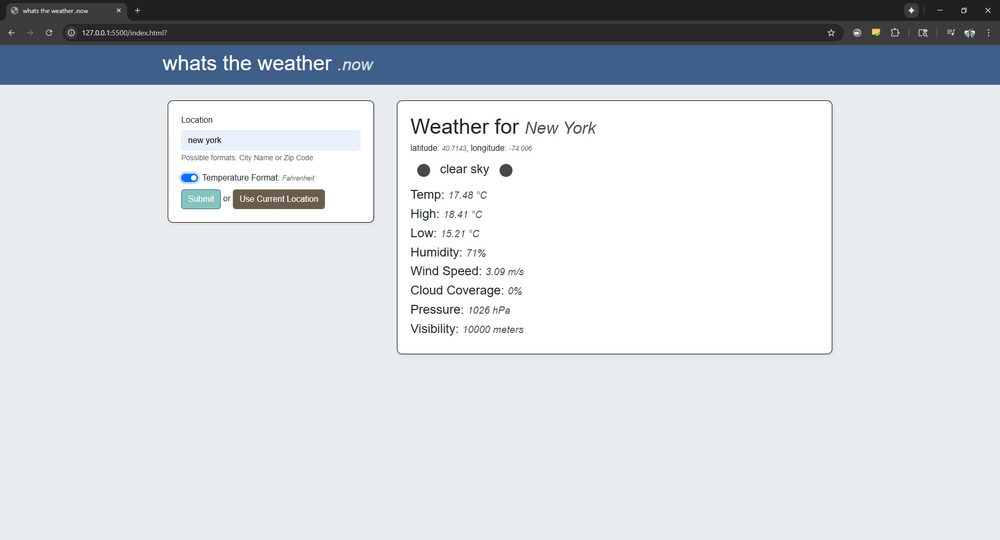
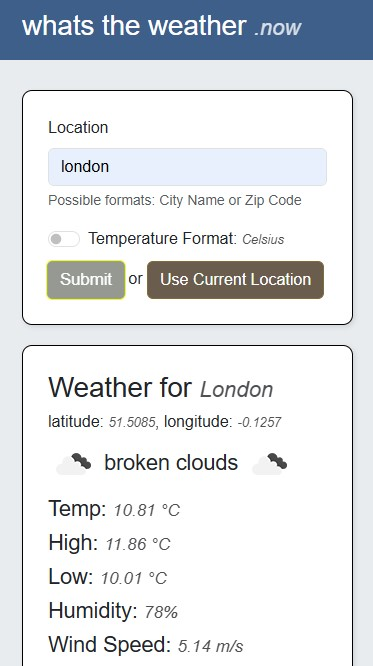

# hw26-weather-app
Using the Open Weather API create a weather application that displays the High, Low, Forecast and Humidity using JavaScript HTML and CSS, based on a given location.

## GH Pages
https://joeyvigil.github.io/hw26-weather-app/

#### Desktop View

#### Mobile View

## Instructions
Using the Open Weather API create a weather application that displays the High, Low, Forecast and Humidity using JavaScript HTML and CSS, based on a given location.

You will need to get your API key from openweathermap.org. Sign up for a new account, and you will be given an API key which will authenticate and allow you access to the data. After creating an account select your user in the top right and hit My API Keys

(Creative freedom is encouraged here)

You will possibly need to change the weather data from Kelvin to Fahrenheit using this formula (Depending on the API endpoint you are accessing)

(32K − 273.15) × 9/5 + 32 = -402.1°F

You can add a zip code to your project if you wish (not a strict requirement).

Once the project is complete, commit the project to github and submit the github repository link to the assignment.

## Links
- [Open Weather API](https://openweathermap.org/api)
- [Open Weather API Documentation](https://openweathermap.org/current)
- [Open Weather API - Get Weather by City Name](https://openweathermap.org/current#name)
- [Open Weather API - Get Weather by Zip Code](https://openweathermap.org/current#zip)
- [Open Weather API - Get Weather by Geographic Coordinates](https://openweathermap.org/current#geo)
- [Open Weather API - Weather Icons](https://openweathermap.org/weather-conditions)

- [W3Schools - How To Create a Temperature Converter](https://www.w3schools.com/howto/howto_js_temperature_converter.asp)

